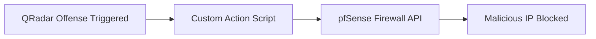

# 🚀 Automated Firewall Blocking with QRadar Custom Actions

## 📌 Introduction

In Security Operations Centers (SOCs), analysts often spend valuable time manually responding to recurring malicious IP connections. This project demonstrates how to automate **incident response in IBM QRadar SIEM** by creating a **custom action script** that blocks malicious IPs directly on a firewall (pfSense).

By reducing response time from minutes to seconds, this automation helps SOC teams improve their **MTTR (Mean Time to Respond)** and strengthens the overall security posture.

---

## 🏗️ Architecture Overview



* **QRadar**: Detects offense (e.g., brute force, port scanning).
* **Custom Action Script**: Python/Bash script triggered by QRadar.
* **pfSense Firewall**: Receives API call → blocks offending IP.

---

## ⚙️ Implementation

### 🔹 Prerequisites

* IBM QRadar CE (Community Edition)
* pfSense Firewall VM
* Python 3 + `requests` library (for API calls)
* API access enabled on pfSense

### 🔹 Steps

1. **Create Custom Action in QRadar**

   * Go to *Admin → Custom Actions → Add*.
   * Configure script execution.

2. **Write Python Script**

```python
import requests
import sys

# Get malicious IP from QRadar offense
malicious_ip = sys.argv[1]

# pfSense API details
url = f"https://<pfsense-ip>/api/v1/firewall/rule"
headers = {"Authorization": "Bearer <API_TOKEN>"}

payload = {
    "action": "block",
    "interface": "wan",
    "source": malicious_ip,
    "description": "Blocked by QRadar Custom Action"
}

response = requests.post(url, json=payload, headers=headers, verify=False)

if response.status_code == 200:
    print(f"[+] Successfully blocked {malicious_ip}")
else:
    print(f"[-] Failed to block {malicious_ip} - {response.text}")
```

3. **Test Workflow**

   * Trigger a QRadar offense with a test IP.
   * Verify rule is pushed to pfSense.
   * Check firewall logs.

---

## 📊 Results

* **Before Automation:** Blocking required manual firewall login (\~3–5 mins).
* **After Automation:** IP blocked automatically in seconds.
* **SOC Value:** Faster containment, reduced analyst fatigue, repeatable playbook.

---

## 🔮 Future Enhancements

* 🔗 Integrate with **Splunk SOAR CE** for advanced playbook orchestration.
* ✅ Add reputation check (VirusTotal/AbuseIPDB) before blocking.
* 🌐 Extend support to other firewalls (Cisco ASA, Palo Alto, Fortinet).

---

## 🧰 Skills & Keywords

* SIEM Engineering (QRadar Custom Actions)
* Firewall Integration (pfSense API)
* Incident Response Automation
* Python, API, SOAR Concepts

---

## 📸 Screenshots (To Add)

* QRadar offense triggered
* Custom Action execution logs
* pfSense block rule added
* Verification of blocked traffic

---

## ✍️ Author

👤 **Taofeek Isiaka-Aliagan**

* 💼 Cybersecurity Engineer (SIEM | SOC | Security Engineering)
* 📜 IBM QRadar SIEM Admin | CompTIA Security+ | ISC² CC
* 🌐 [LinkedIn](https://linkedin.com/in/taotechtips) | [Medium](https://medium.com/@taotechtips)
