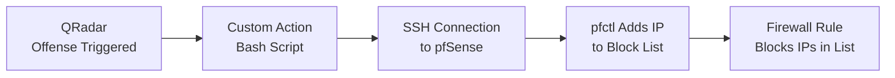

# Automated Firewall Blocking with QRadar Custom Actions

## 📌 Introduction

In Security Operations Centers (SOCs), analysts often spend valuable time manually responding to recurring malicious IP connections. This project demonstrates how to automate **incident response in IBM QRadar SIEM** by creating a **custom action script** that blocks malicious IPs directly on a firewall (pfSense).

By reducing response time from minutes to seconds, this automation helps SOC teams improve their **MTTR (Mean Time to Respond)** and strengthens the overall security posture.

---

## 🏗️ Architecture Overview

### Network Architecture


### Workflow



* **QRadar**: Detects offense (e.g., brute force).
* **Custom Action Script**: Bash script runs when offense is triggered.
* **pfSense Firewall**: Executes `pfctl` command which blocks offending IP.

---

## ⚙️ Implementation

### Prerequisites

* IBM QRadar CE (SIEM)
* pfSense (Router x Firewall)
* Windows Server (Victim Machine)
* SSH access with restricted admin privileges using ssh keys for authentication
* Bash Script

### Steps

1. [**Prepare pfSense**](https://github.com/TaoTechTips/QRadar-siem-firewall-response/blob/main/1.%20Preparing%20pfSense.md)

2. [**Prepare QRadar**](https://github.com/TaoTechTips/QRadar-siem-firewall-response/blob/main/2.%20Preparing%20QRadar.md)

1. **Write Bash Script**

    ```bash
    #!/bin/bash
    #
    # block_ip.sh - Add an IP address to pfSense blocklist via SSH
    
    # === Configuration ===
    PFSENSE_HOST="10.10.1.1"
    PFSENSE_USER="qradar_usr"
    SSH_KEY="/home/customactionuser/.ssh/id_rsa"
    BLOCK_TABLE="qradar_blocklist"
    
    # === Input validation ===
    if [ -z "$1" ]; then
        echo "Usage: $0 <IP_ADDRESS>"
        exit 1
    fi
    
    IP=$1
    
    # === Add IP to blocklist ===
    ssh -i "$SSH_KEY" -o StrictHostKeyChecking=no "$PFSENSE_USER@$PFSENSE_HOST" \
        "sudo /sbin/pfctl -t $BLOCK_TABLE -T add $IP"
    
    # === Check result ===
    if [ $? -eq 0 ]; then
        echo "[+] Successfully added $IP to blocklist ($BLOCK_TABLE)"
    else
        echo "[-] Failed to add $IP to blocklist"
        exit 1
    fi
    ```
    

4. [**Create QRadar Custom Action and Rule Test**](https://github.com/TaoTechTips/QRadar-siem-firewall-response/blob/main/3.%20QRadar%20Custom%20Action%20Setup%20and%20Rule%20Creation.md)


5. **Test Workflow**

   * Trigger a QRadar offense with a test IP.
   * QRadar offense is generated and automated response is triggered.
   * Verify pfSense now has the IP in its block list.
     ```bash
     pfctl -t qradar_blocklist -T show
     ```
   * Verify blocked connection in firewall logs.   
     
---

## 📸 Screenshots

* QRadar offense triggered

  

  

* Custom Action execution logs

  

* Verification of blocked traffic
  
  --- Blocked RDP connection ---
  
  

  --- Blocked QRadar UI Connection (HTTPS) ---
  
  

  --- Firewall Log Showing Blocked Traffic ---

  

---

## 📊 Results

* **Before Automation:** Blocking malicious IPs required manual firewall login (\~3–5 mins).
* **After Automation:** QRadar offense triggers script -> IP blocked automatically in seconds.
* **SOC Value:** Faster response & containment, reduced analyst fatigue, repeatable playbook.

---

## 🔮 Future Enhancements

* Integrate with email sever to send email alerts to analysts for review.
* Add an unblock script to restore connection after analyst review if false positive.
* Add a step to check IP reputation before taking action.
* Integrate with **Splunk SOAR CE** for advanced playbook orchestration.

---

## 🧰 Skills & Keywords

* SIEM Engineering (QRadar Custom Actions)
* Firewall Integration
* Bash Scripting
* SOC Workflow Optimization
* Incident Response Automation

---

## ✍️ Author

👤 **Taofeek Isiaka-Aliagan**

* 💼 Cybersecurity Engineer (SIEM | SOC | Security Engineering)
* 📜 IBM QRadar SIEM Admin | CompTIA Security+ | ISC² CC
* 🌐 [LinkedIn](https://linkedin.com/in/taotechtips) | [Medium](https://medium.com/@taotechtips)
